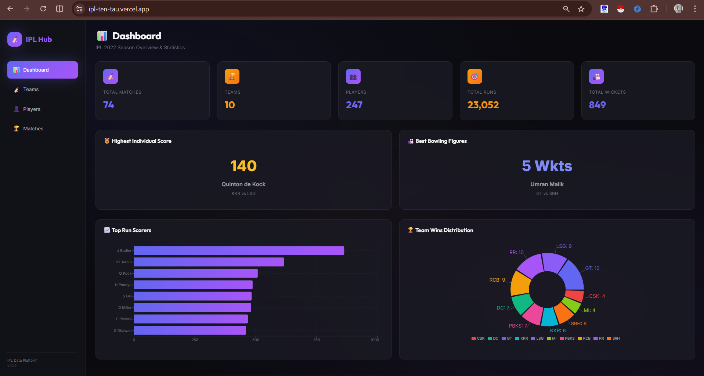
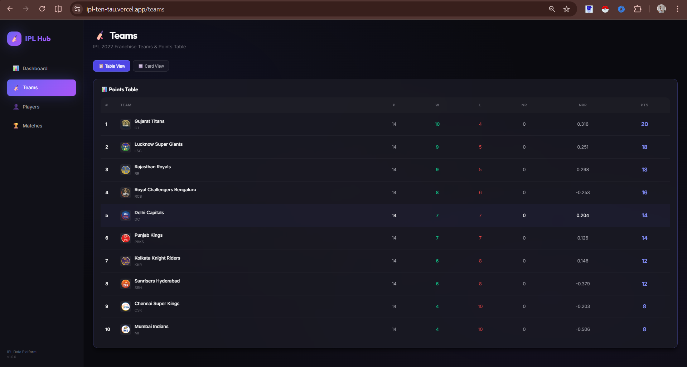
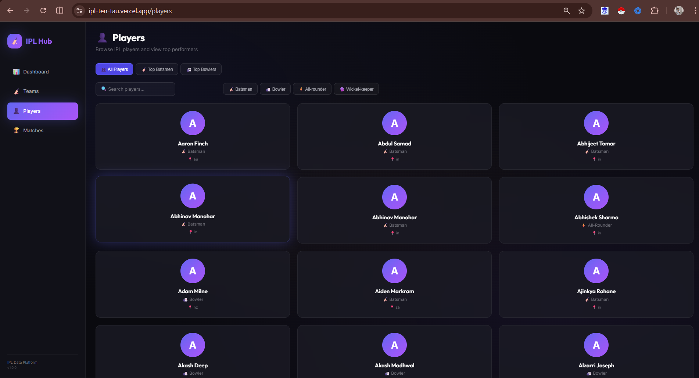
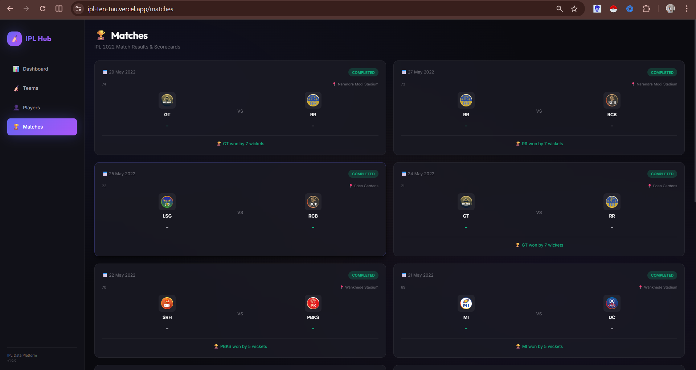
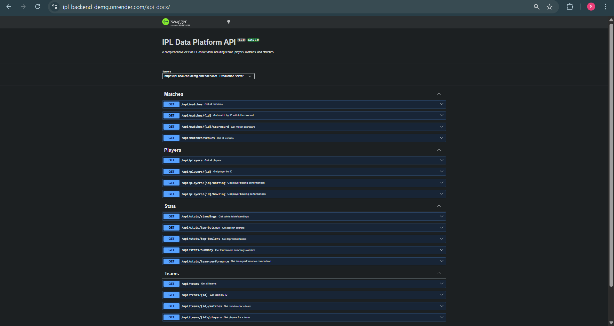

# 🏏 IPL Data Platform

A full-stack web application for exploring and visualizing IPL (Indian Premier League) cricket data. Built with Node.js, React, PostgreSQL, and deployed on cloud platforms.



## 🌐 Live Demo

| Service | URL |
|:---|:---|
| **Frontend** | [https://ipl-ten-tau.vercel.app/](https://ipl-ten-tau.vercel.app/) |
| **Backend API** | [https://ipl-backend-demg.onrender.com](https://ipl-backend-demg.onrender.com) |
| **API Documentation** | [https://ipl-backend-demg.onrender.com/api-docs](https://ipl-backend-demg.onrender.com/api-docs) |

## 📋 Table of Contents

- [Features](#-features)
- [Tech Stack](#-tech-stack)
- [Project Structure](#-project-structure)
- [Database Schema](#-database-schema)
- [API Endpoints](#-api-endpoints)
- [Local Setup](#-local-setup)
- [Docker Setup](#-docker-setup)
- [Deployment](#-deployment)
- [Screenshots](#-screenshots)
- [Assumptions](#-assumptions)

## ✨ Features

### Backend
- ✅ RESTful API with Express.js
- ✅ PostgreSQL database with Prisma ORM
- ✅ Comprehensive data modeling (10 relational tables)
- ✅ Pagination and filtering support
- ✅ OpenAPI/Swagger documentation
- ✅ Health check endpoint
- ✅ Keep-alive mechanism for free tier hosting
- ✅ Dockerized for containerized deployment

### Frontend
- ✅ Modern React 18 with Vite
- ✅ 4 interactive pages (Dashboard, Teams, Players, Matches)
- ✅ 2 interactive charts (Bar Chart, Pie Chart)
- ✅ Multiple table views with sorting
- ✅ Search and filter functionality
- ✅ Loading, Error, and Empty state handling
- ✅ Premium dark theme with glassmorphism
- ✅ Fully responsive design
- ✅ Dockerized for containerized deployment

## 🛠 Tech Stack

| Layer | Technology |
|:---|:---|
| **Frontend** | React 18, Vite, React Router, Axios, Recharts |
| **Backend** | Node.js, Express.js, Prisma ORM |
| **Database** | PostgreSQL (Neon Cloud) |
| **Documentation** | Swagger/OpenAPI (swagger-jsdoc) |
| **Containerization** | Docker, Docker Compose |
| **Deployment** | Vercel (Frontend), Render (Backend) |

## 📁 Project Structure

```
ipl-data-platform/
├── backend/                 # Backend API
│   ├── prisma/
│   │   ├── schema.prisma    # Database schema
│   │   ├── migrations/      # Database migrations
│   │   └── seed.js          # Data seeding script
│   ├── src/
│   │   ├── routes/          # API route handlers
│   │   ├── lib/             # Shared utilities
│   │   └── index.js         # Express app entry
│   ├── Dockerfile           # Backend container config
│   └── README.md            # Backend documentation
│
├── frontend/                # Frontend Application
│   ├── src/
│   │   ├── api/             # API client
│   │   ├── components/      # Reusable components
│   │   ├── pages/           # Route pages
│   │   └── index.css        # Design system
│   ├── Dockerfile           # Frontend container config
│   └── README.md            # Frontend documentation
│
├── docker-compose.yml       # Multi-container orchestration
└── README.md                # This file
```

## 🗄 Database Schema

The database consists of **10 relational tables** designed to model IPL cricket data:

```
┌─────────────┐     ┌─────────────┐     ┌─────────────┐
│    Team     │────<│ TeamPlayer  │>────│   Player    │
└─────────────┘     └─────────────┘     └─────────────┘
       │                                       │
       │            ┌─────────────┐            │
       └───────────>│    Match    │<───────────┘
                    └─────────────┘
                           │
              ┌────────────┼────────────┐
              ▼            ▼            ▼
       ┌──────────┐  ┌──────────┐  ┌──────────┐
       │ Innings  │  │  Venue   │  │ Standing │
       └──────────┘  └──────────┘  └──────────┘
              │
    ┌─────────┴─────────┐
    ▼                   ▼
┌────────────────┐ ┌────────────────┐
│ BattingPerf    │ │ BowlingPerf    │
└────────────────┘ └────────────────┘
```

**Models:**
- `Team` - IPL franchises
- `Player` - Cricket players
- `TeamPlayer` - Player-team roster mapping
- `Match` - Match details and results
- `Venue` - Stadiums/Grounds
- `Innings` - Scorecard summary
- `BattingPerformance` - Individual batting stats
- `BowlingPerformance` - Individual bowling stats
- `Standing` - Points table data

## 🔌 API Endpoints

### Health & Info
| Method | Endpoint | Description |
|:---|:---|:---|
| GET | `/api/health` | Health check |
| GET | `/` | API info |

### Teams
| Method | Endpoint | Description |
|:---|:---|:---|
| GET | `/api/teams` | List all teams (paginated) |
| GET | `/api/teams/:id` | Get team by ID |
| GET | `/api/teams/:id/players` | Get team roster |
| GET | `/api/teams/:id/matches` | Get team matches |

### Players
| Method | Endpoint | Description |
|:---|:---|:---|
| GET | `/api/players` | List players (paginated, searchable) |
| GET | `/api/players/:id` | Get player by ID |
| GET | `/api/players/:id/batting` | Get batting stats |
| GET | `/api/players/:id/bowling` | Get bowling stats |

### Matches
| Method | Endpoint | Description |
|:---|:---|:---|
| GET | `/api/matches` | List matches (paginated) |
| GET | `/api/matches/:id` | Get match by ID |
| GET | `/api/matches/:id/scorecard` | Get full scorecard |

### Statistics
| Method | Endpoint | Description |
|:---|:---|:---|
| GET | `/api/stats/standings` | Points table |
| GET | `/api/stats/top-batsmen` | Top run scorers |
| GET | `/api/stats/top-bowlers` | Top wicket takers |
| GET | `/api/stats/summary` | Tournament summary |
| GET | `/api/stats/team-performance` | Team performance stats |

📖 **Full API Documentation:** [Swagger UI](https://ipl-backend-demg.onrender.com/api-docs)

## ⚙️ Local Setup

### Prerequisites
- Node.js 18+
- PostgreSQL database (or Neon account)

### Backend Setup
```bash
cd backend
npm install

# Configure environment
cp .env.example .env
# Edit .env with your DATABASE_URL

# Setup database
npx prisma db push
npm run db:seed

# Start server
npm run dev
# API running on http://localhost:5000
```

### Frontend Setup
```bash
cd frontend
npm install

# Configure environment (optional)
echo "VITE_API_URL=http://localhost:5000/api" > .env

# Start dev server
npm run dev
# App running on http://localhost:5173
```

## 🐳 Docker Setup

Run the entire stack with Docker Compose:

```bash
# Build and start all services
docker-compose up -d --build

# Services:
# - Backend:  http://localhost:5000
# - Frontend: http://localhost:3000
```

## 🚀 Deployment

### Backend (Render)
1. Create a Web Service on Render
2. Connect GitHub repository
3. Set **Root Directory** to `backend`
4. Select **Docker** runtime
5. Add environment variable: `DATABASE_URL`

### Frontend (Vercel)
1. Import project in Vercel
2. Set **Root Directory** to `frontend`
3. Add environment variable: `VITE_API_URL=https://ipl-backend-demg.onrender.com/api`

## 📸 Screenshots

### Dashboard


### Teams Page


### Players Page


### Matches Page


### API Documentation


> Add screenshots to the `screenshots/` folder

## 📝 Assumptions

The following assumptions were made during development:

1. **Dataset Scope**: Only IPL 2022 season data is loaded for demonstration.
2. **Authentication**: No user authentication is implemented as it was not specified in requirements.
3. **Real-time Updates**: The application displays static historical data, not live match updates.
4. **Player Images**: Player avatars are generated using initials as actual images were not provided.
5. **Team Logos**: External URLs from the dataset are used; fallback to abbreviations if unavailable.
6. **Performance**: Pagination limits are set to reasonable defaults (10-20 items per page).
7. **Database**: Neon PostgreSQL (free tier) is used; may experience cold start delays.
8. **Hosting**: Free tier hosting on Render/Vercel; services may sleep after inactivity.

## 👨‍💻 Author

**Swapnil Dev**
- GitHub: [@Swapnildev2003](https://github.com/Swapnildev2003)

## 📄 License

This project is for educational/internship purposes.

---

Built with ❤️ for the Full-Stack Internship Assignment
